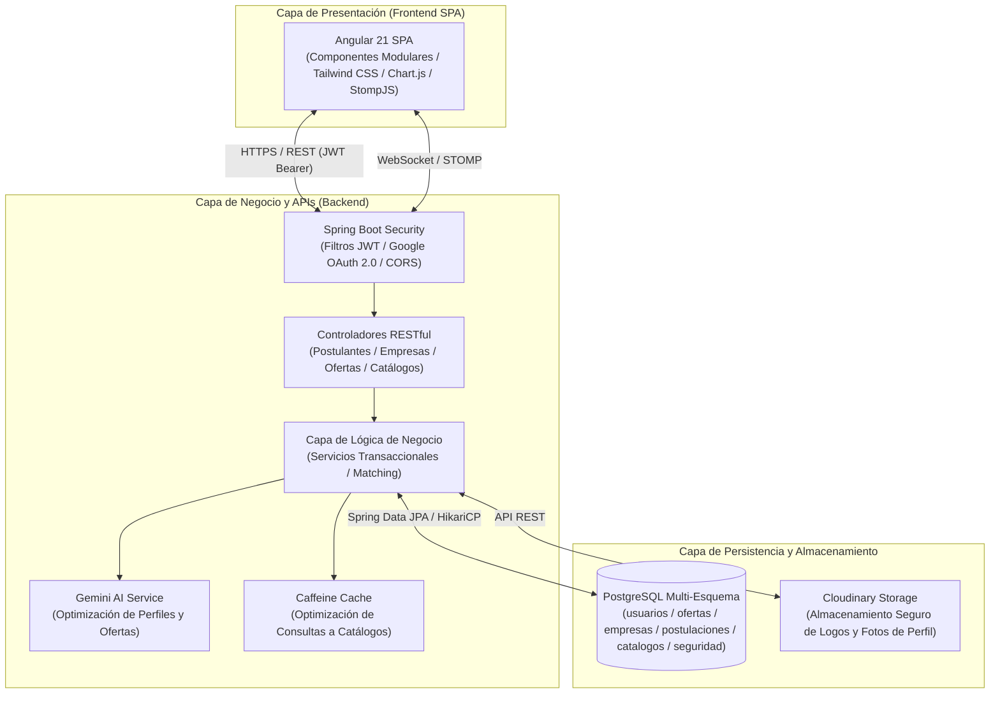

# Bolsa de Empleo Web Platform
### *Plataforma Empresarial de Gestión de Talento, Intermediación Laboral e Inteligencia de Empleabilidad*

[](https://openjdk.org/)
[](https://spring.io/projects/spring-boot)
[](https://angular.dev/)
[](https://www.postgresql.org/)
[](https://ai.google.dev/)
[](https://developers.google.com/identity)
[](https://www.docker.com/)
[](https://tailwindcss.com/)

---

## Tabla de Contenidos
1. [Resumen Ejecutivo](#resumen-ejecutivo)
2. [Arquitectura del Sistema](#arquitectura-del-sistema)
3. [Módulos Funcionales del Sistema](#módulos-funcionales-del-sistema)
4. [Control de Acceso Basado en Roles (RBAC)](#control-de-acceso-basado-en-roles-rbac)
5. [Integración con Inteligencia Artificial](#integración-con-inteligencia-artificial)
6. [Stack Tecnológico](#stack-tecnológico)
7. [Estructura del Proyecto](#estructura-del-proyecto)
8. [Aseguramiento de la Calidad y Pruebas (QA)](#aseguramiento-de-la-calidad-y-pruebas-qa)
9. [Guía de Instalación y Despliegue](#guía-de-instalación-y-despliegue)
10. [Seguridad y Protección de Datos](#seguridad-y-protección-de-datos)
11. [Licencia y Derechos](#licencia-y-derechos)

---

## Resumen Ejecutivo

**Bolsa de Empleo Web** es una plataforma integral de nivel empresarial diseñada para conectar de manera ágil, segura y transparente a postulantes, empresas empleadoras e instituciones académicas o corporativas.

La solución aborda la fragmentación del reclutamiento tradicional mediante:
* **Digitalización Integral de Perfiles:** Creación de hojas de vida estructuradas con secciones académicas, experiencia profesional, certificaciones, idiomas y competencias, con capacidad de exportación instantánea en PDF.
* **Gestión de Ciclo de Vida de Vacantes:** Publicación parametrizada de ofertas laborales, control de estados de postulación en tiempo real y comunicación directa entre empleadores y candidatos.
* **Matching Asistido por Inteligencia Artificial:** Integración nativa con Google Gemini para la redacción optimizada de descripciones de puestos y la evaluación contextual de compatibilidad entre hojas de vida y vacantes.
* **Control y Parametrización Administrativa:** Gobierno centralizado de catálogos institucionales (carreras, facultades, modalidades, jornadas, ubicaciones) y auditoría de validación de empresas y ofertas.

---

## Arquitectura del Sistema

La solución adopta una arquitectura desacoplada y orientada a servicios (SOA) en tres capas principales:



### Principios de Arquitectura
1. **Segregación de Esquemas en Base de Datos:** PostgreSQL organiza las entidades en esquemas lógicos dedicados (`usuarios`, `empresas`, `ofertas`, `postulaciones`, `catalogos`, `seguridad`), garantizando integridad referencial, orden y aislamiento de responsabilidades.
2. **Alta Disponibilidad y Caché:** Las consultas recurrentes a catálogos paramétricos utilizan Caffeine Cache en memoria, reduciendo la carga sobre la base de datos y manteniendo tiempos de respuesta en milisegundos.
3. **Comunicación Asíncrona en Tiempo Real:** Notificaciones de postulaciones y cambios de estado sincronizados mediante WebSockets (STOMP sobre SockJS).

---

## Módulos Funcionales del Sistema

| Módulo | Descripción Funcional |
| :--- | :--- |
| **Módulo de Candidatos y Postulantes** | Gestión de perfil profesional 360 grados: datos personales, formación universitaria, cursos y certificaciones, experiencia laboral, idiomas y habilidades. Motor de búsqueda avanzada con filtros multifacéticos (provincia, ciudad, modalidad presencial/híbrida/remota, jornada, salario, facultad). Generación de currículum en PDF y seguimiento de postulaciones. |
| **Módulo de Empresas Empleadoras** | Registro y autenticación empresarial con validación de razón social y RUC. Publicación y administración de convocatorias de empleo, definición de requisitos y beneficios. Panel de revisión de postulantes con visualización detallada de expedientes, descarga de hojas de vida y cambio de fases del proceso de selección. |
| **Módulo de Administración Central** | Panel de control integral para administradores de la plataforma. Aprobación y verificación de legitimidad de empresas y ofertas laborales. Gestión de catálogos maestros: Facultades, Carreras, Categorías, Idiomas, Jornadas, Modalidades, Provincias y Ciudades. Reportes consolidados y exportación en Microsoft Excel y PDF. |
| **Módulo de Inteligencia Artificial (Gemini AI)** | Asistente cognitivo integrado que apoya a las empresas en la redacción precisa de perfiles de vacantes y sugiere a los postulantes mejoras para alinear su perfil profesional con las demandas del mercado. |
| **Módulo de Notificaciones y Tiempo Real** | Canal bidireccional vía WebSockets que informa a los candidatos cuando su postulación cambia de estado (Revisión, Seleccionado, Descartado) y notifica a las empresas ante nuevas postulaciones recibidas. |

---

## Control de Acceso Basado en Roles (RBAC)

La plataforma implementa un modelo jerárquico de control de acceso gestionado por Spring Security:

| Rol del Sistema | Identificador Técnico | Permisos y Alcance Operativo |
| :--- | :--- | :--- |
| **Administrador** | `ROLE_ADMIN` | Acceso global a la plataforma: Gestión de catálogos maestros, aprobación y bloqueo de empresas, auditoría de vacantes publicadas, supervisión de usuarios y extracción de métricas globales. |
| **Empresa Empleadora** | `ROLE_EMPRESA` | Gestión del perfil corporativo, creación y edición de ofertas laborales, recepción de solicitudes, revisión de hojas de vida y cambio de estado de postulaciones asignadas a sus vacantes. |
| **Postulante / Candidato** | `ROLE_POSTULANTE` | Administración del perfil profesional personal, postulación a ofertas activas, consulta del estado de postulaciones y descarga del currículum generado por la plataforma. |

---

## Integración con Inteligencia Artificial

El servicio `GeminiAiService` encapsula la interacción con la API de Google Gemini utilizando modelos de última generación (`gemini-2.5-flash`):

* **Generación y Corrección de Ofertas Laborales:** Transforma borradores informales de vacantes en descripciones estructuradas bajo estándares de competencias del sector productivo.
* **Optimización de Perfiles Profesionales:** Analiza los campos ingresados por el postulante y genera sugerencias personalizadas de síntesis curricular para maximizar su empleabilidad.
* **Análisis de Relevancia:** Evalúa la correspondencia léxica y semántica entre los requerimientos de la oferta y las cualificaciones del aspirante.

---

## Stack Tecnológico

### Capa de Backend
* **Lenguaje:** Java 17 LTS
* **Framework:** Spring Boot (Spring MVC, Spring Data JPA, Spring Security)
* **Autenticación:** JWT (JSON Web Tokens con JJWT 0.11.5) y Google OAuth 2.0 Client
* **Persistencia:** Hibernate 6 / HikariCP
* **Caché:** Caffeine Cache
* **Generación Documental:** Apache POI 5.2 (Excel OOXML) e iText / Apache PDFBox (PDF)
* **Integración IA:** Google Gemini API Client

### Capa de Frontend
* **Framework:** Angular 21.0.0 (Standalone Components, Signals, Reactive Forms)
* **Estilos y UI:** Tailwind CSS, FontAwesome, Google Material Icons
* **Visualización de Datos:** Chart.js 4.5 y ng2-charts
* **Tiempo Real:** StompJS y SockJS Client
* **Exportación Cliente:** jsPDF y jsPDF-AutoTable, XLSX

### Base de Datos e Infraestructura
* **Base de Datos:** PostgreSQL con soporte multi-esquema y extensiones relacionales
* **Migraciones de Esquema:** Flyway Migrations
* **Almacén Multimedia:** Cloudinary CDN para imágenes y logotipos
* **Contenedores:** Docker y Docker Compose
* **Servidor Web Reverso:** Nginx Alpine para la entrega de estáticos en producción

---

## Estructura del Proyecto

```
BolsaDeEmpleoWeb/
├── backend/                                # Núcleo del servidor Spring Boot
│   ├── src/
│   │   ├── main/
│   │   │   ├── java/com/example/demo/
│   │   │   │   ├── config/                # Seguridad, CORS, JWT, Cache y WebSockets
│   │   │   │   ├── controller/            # Endpoints REST expuestos a la aplicación
│   │   │   │   ├── entity/                # Entidades JPA organizadas por esquema relacional
│   │   │   │   ├── repository/            # Interfaces de persistencia Spring Data JPA
│   │   │   │   ├── service/               # Lógica de negocio y clientes externos (Gemini AI)
│   │   │   │   └── util/                  # Generadores de PDF, Excel y utilitarios
│   │   │   └── resources/
│   │   │       ├── application.properties # Configuración base del sistema
│   │   │       ├── application-local.properties
│   │   │       └── application-prod.properties
│   │   └── test/                          # Baterías de pruebas unitarias y de regresión
│   ├── Dockerfile                         # Construcción multi-etapa con JDK 17
│   └── pom.xml                            # Gestión de dependencias Maven
├── frontend/                               # Interfaz táctica en Angular
│   ├── src/
│   │   ├── app/
│   │   │   ├── components/                # Vistas principales (Panel-Admin, Perfiles, Ofertas)
│   │   │   ├── services/                  # Servicios de consumo HTTP y estado reactivo
│   │   │   └── guards/                    # Guardianes de ruta según rol del usuario
│   ├── Dockerfile                         # Construcción de frontend con Nginx Alpine
│   ├── nginx.conf                         # Configuración del servidor web de producción
│   └── package.json                       # Dependencias Node y librerías cliente
├── docker-compose.yml                      # Orquestación de contenedores backend y frontend
├── .env.example                            # Plantilla de variables de entorno
└── README.md                               # Documentación principal de la plataforma
```

---

## Aseguramiento de la Calidad y Pruebas (QA)

El proyecto cuenta con un plan de aseguramiento de calidad exhaustivo que comprende pruebas unitarias, de integración, de regresión y smoke tests:

### Pruebas de Backend (JUnit 5 & Mockito)
```bash
# Ejecutar la suite completa de pruebas unitarias y de integración
cd backend
./mvnw test

# Ejecutar pruebas específicas de regresión
./mvnw test -Dtest=RegresionRegistroAutenticacionTest
./mvnw test -Dtest=RegresionOfertasValidacionTest
./mvnw test -Dtest=RegresionPostulacionRevisionTest

# Smoke tests de despliegue
./mvnw test -Dtest=DespliegueSmokeTest
```

### Cobertura de Pruebas Automatizadas
* **ModuloAutenticacionTest:** Validación de emisión y expiración de tokens JWT y flujo Google OAuth.
* **ModuloRegistroTest:** Registro consistente de postulantes y empresas con sanitización de entradas.
* **ModuloOfertasTest / ModuloValidacionOfertasTest:** Ciclo de publicación, límites de cupos y caducidad.
* **ModuloPostulacionesTest:** Flujo completo de aplicación, doble postulación prevenida y transiciones de estado.
* **ModuloPerfilProfesionalTest:** Integridad referencial de cursos, experiencia y formación académica.

---

## Guía de Instalación y Despliegue

### Requisitos Previos
* **Java Development Kit (JDK):** Versión 17 o superior
* **Node.js:** Versión 20 o superior y **NPM** v10+
* **PostgreSQL:** Versión 14 o superior (o instancia en la nube compatible)
* **Docker & Docker Compose:** Opcional para despliegue automatizado en contenedores

---

### Opción 1: Despliegue Local para Desarrollo

#### 1. Configuración de Base de Datos
Crear la base de datos en PostgreSQL:
```sql
CREATE DATABASE bolsa_empleo;
```

#### 2. Configuración y Ejecución del Backend
Configurar las variables de entorno requeridas en `backend/src/main/resources/application-local.properties`:
```properties
spring.datasource.url=jdbc:postgresql://localhost:5432/bolsa_empleo
spring.datasource.username=postgres
spring.datasource.password=tu_contrasena
jwt.secret=tu_clave_secreta_de_al_menos_256_bits
gemini.api.key=tu_api_key_de_google_gemini
google.clientId=tu_google_client_id
```

Ejecutar el servidor Spring Boot:
```bash
cd backend
./mvnw spring-boot:run
```
*El API REST iniciará por defecto en `http://localhost:8080`.*

#### 3. Configuración y Ejecución del Frontend
Instalar dependencias y levantar el servidor de desarrollo:
```bash
cd frontend
npm install
npm start
```
*La interfaz gráfica estará disponible en `http://localhost:4200`.*

---

### Opción 2: Despliegue Automatizado con Docker Compose

La plataforma incluye configuración lista para despliegue mediante contenedores:

1. Crear el archivo `.env` a partir de la plantilla:
```bash
cp .env.example .env
```

2. Configurar las credenciales en el archivo `.env`:
```env
BACKEND_PORT=8080
SPRING_DATASOURCE_URL=jdbc:postgresql://host.docker.internal:5432/bolsa_empleo
SPRING_DATASOURCE_USERNAME=postgres
SPRING_DATASOURCE_PASSWORD=tu_contrasena
JWT_SECRET=tu_clave_secreta_jwt_de_alta_entropia
GEMINI_API_KEY=tu_api_key
```

3. Construir y levantar los servicios:
```bash
docker compose up -d --build
```
* **Frontend Web (Nginx):** `http://localhost:4200` o `http://localhost:80`
* **Backend REST API:** `http://localhost:8080`

---

## Seguridad y Protección de Datos

* **Protección Criptográfica de Sesiones:** Firmado de tokens JWT utilizando HMAC con SHA-512, con tiempos de expiración controlados y revocación segura de credenciales.
* **Federación de Identidad con Google:** Integración de Google Identity Services con verificación criptográfica del token ID en el backend antes de autorizar la sesión.
* **Control de Cors e Inyección SQL:** Filtros CORS configurados explícitamente para dominios de confianza y consultas parametrizadas a través de repositorios Spring Data JPA para mitigar ataques SQL Injection.
* **Sanitización y Validación de Entradas:** Validación declarativa mediante Java Bean Validation (`@NotNull`, `@Size`, `@Pattern`, `@Email`) en todos los DTOs de entrada.

---

## Licencia y Derechos

(C) 2026 **Bolsa de Empleo Web Platform**. Todos los derechos reservados.  
Plataforma desarrollada para la intermediación laboral, vinculación universidad-empresa y gestión estratégica de talento humano. Queda prohibida su distribución o uso no autorizado sin previa licencia institucional.
